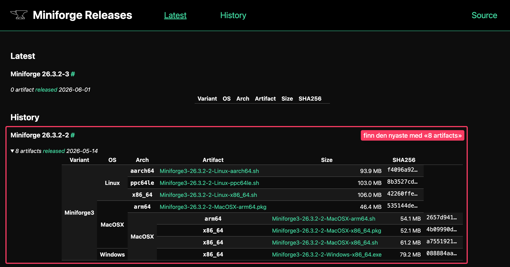

Ein kort guide for å installera og opna Jupyter Lab med Miniforge.

::: {.callout-tip collapse="true"}
## Guiden på 1-2-3

[1) Installera Miniforge](#installera)

[2) Laga eit miljø med Jupyter Lab og viktige pakkar](#miljo)

[3) Opna og køyra](#opna)
:::

⏱️ Sist oppdatert: 14.08.2026

---

## 1️⃣ Installera Miniforge {#installera}

Miniforge lastar du ned [her](https://conda-forge.org/download/).

::: callout-important
## Viktig

Vel fila som passar til maskina di:

-   **Windows:** `Miniforge3-Windows-x86_64.exe`

-   **Mac med Apple-brikke (M1, M2, M3, M4):** `Miniforge3-MacOSX-arm64.pkg`

-   **Mac med Intel:** `Miniforge3-MacOSX-x86_64.pkg`

Er du usikker på kva slags Mac du har? Klikk på eplet øvst til venstre → «Om denne maskinen» → sjå på linja «Brikke» eller «Prosessor».

{fig-align="center"}
:::

Når du har lasta ned fila:

-   opne nedlastingar og klikk på fila

-   følg installasjonsrettleiinga

-   på Windows: la det stå kryss ved **«Create start menu shortcuts»**

-   **OBS:** Du treng **ikkje** laga brukar eller logga inn nokon stad.

## 2️⃣ Laga eit miljø med Jupyter Lab og viktige pakkar {#miljo}

Resten av installasjonen skjer i terminalen. Det er litt ulikt på Mac og Windows. Sjå aktuell fane under:

::: panel-tabset
## Mac

Opne programmet «Terminal».

Du kan søka etter appen med Spotlight: anten forstørringsglaset på menylinja øvst på skjermen eller snarvegen  på tastaturet.

## Windows

Opne programmet «Miniforge Prompt».

Du kan søka etter appen frå Start-menyen. Trykk -knappen på tastaturet.
:::

I programmet/terminalen skal du skriva litt kode. Trykk  etter kvar linje. Hugs at du kan kopiera inn kodelinjene herfrå. Du treng ikkje skriva av.

``` bash
conda create -n matte-1t python=3.12 jupyterlab numpy matplotlib pandas scipy ipywidgets
```

**OBS:** dette er eit forslag, du kan legga til eller trekka frå pakkar etter behov. 

Når programmet har tenkt seg om (av og til ganske lenge) får du opp `Proceed ([y]/n)?`. Trykk  for å halda fram.

No har me laga eit *miljø* (eit roterom) der me har installert alt me treng. Vert det kluss, eller me treng andre pakkar og program i andre fag, kan me laga nye miljø.

## 3️⃣ Opna og køyra {#opna}

::: callout-tip
## Tips

Det som står vidare her er måten du opnar Jupyter Lab på. **Alltid**.
:::

**1) Opne «Miniforge Prompt» (Windows) / «Terminal» (Mac).**

**2) Skriv inn**

``` bash
conda activate matte-1t
```

Du ser at du har gjort rett om det står `(matte-1t)`, og ikkje `(base)` framfor brukarnamnet ditt.

**3) Skriv inn**

``` bash
jupyter lab
```

No opnar programmet seg i ei fane i nettlesaren.

::: callout-tip
## Lukka

Når du er ferdig med programmet, lukkar du fana i nettlesaren.

**I tillegg** går du tilbake til Miniforge Prompt / Terminal og trykkjer  på tastaturet.
:::

::: {.callout-warning collapse="true"}
## Om noko går gale

**«conda: command not found» / «conda er ikkje gjenkjent»**

Lukk terminalvindauget heilt og opne det på nytt. På Windows: pass på at du brukar «Miniforge Prompt», ikkje vanleg «Ledetekst» eller PowerShell.

**Det står framleis `(base)`**

Då er miljøet ikkje aktivert. Køyr `conda activate matte-1t` på nytt og sjå etter skrivefeil i namnet.

**«EnvironmentNameNotFound»**

Miljøet er ikkje laga enno, *eller* så er det skrivefeil. Gå tilbake til [steg 2](#miljo).

**Nettlesarfana opnar seg ikkje av seg sjølv**

Kopier adressa som byrjar med `http://localhost:8888/...` frå terminalen og lim ho inn i nettlesaren.
:::